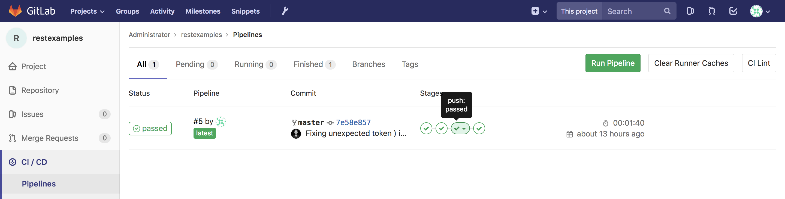

gitlab-ci-stack
======================================================================================
[](https://travis-ci.org/jonashackt/gitlab-ci-stack)

Full CI pipeline project based on Gitlab & Gitlab CI running Docker, completely automated setup by Vagrant & Ansible, providing Let´s Encrypt certificates for private Servers, multiple Gitlab-Runners and the Gitlab Container Registry

This project is somehow based on the thought of https://github.com/marcelbirkner/docker-ci-tool-stack. But since the good old days of Jenkins times changed "a bit". Maybe today Jenkins incl. 2.x/Pipeline-plugin isn´t the way to go - or it´s just the way, if you really want to have a hard time. Why? Here are some points:

"Jenkins servers become snowflakes"

"Jenkins 2.0 tries to address this by promoting a Pipeline plugin (plus another plugin to visualize it), but it kind of misses the point."

https://content.pivotal.io/blog/comparing-bosh-ansible-chef-part-1


I heard from so many colleagues: 

> "Hey Jonas you Jenkins fanboy. Have a look on all those cool new CI servers like Concourse, Circle CI oder even Gitlab CI! We don´t know, why you´re messing around with Jenkins..." .

## Which one to choose?

Well, ok then. Let´s give it a try. And because of all this here:

https://www.digitalocean.com/community/tutorials/ci-cd-tools-comparison-jenkins-gitlab-ci-buildbot-drone-and-concourse

https://www.slant.co/versus/2482/10699/~gitlab-ci_vs_concourse-ci

https://www.reddit.com/r/devops/comments/6cuj0s/concourse_jenkins_ci/

https://concourse-ci.org/concourse-vs.html

Therefore I wanted to have a deeper look into Gitlab.

## Gitlab CI

Today Gitlab not only offers a alternative to Bitbucket Server or GitHub Enterprise, they also offer an [alternate CI-Implementation](https://docs.gitlab.com/ce/ci/README.html):


Source: https://docs.gitlab.com/ce/ci/README.html


## Why not just use Docker Compose to fire everything up?

Back in 2015 Marcel already fired up everything with Docker Compose (as I mentioned https://github.com/marcelbirkner/docker-ci-tool-stack). It is also easy to fire up Gitlab with Docker Compose locally, just fire up inside this repo:

`docker-compose up -d`

__BUT__: There are some prerequisites needed for Gitlab CI on your Machine: Docker & Compose have to be installed, and you need to manually install and configure Gitlab Runners - amongst some other things.

What I really love is to achieve comprehensible solutions that are usable as is in your project. And you won´t run your Companie´s Gitlab on your local machine, would you?! You will always try to get a server and install Gitlab there. 

To achieve a fully comprehensible setup here, we some DevOps tools FTW:

* Ansible: This shiny pice will contain __ALL__ steps necessary to provision a Gitlab server with __everything__ needed. It´s also a great documentation what´s needed to setup a Gitlab server.
* Vagrant: To just fire up a server locally that is based on a certain OS - because that´s needed to craft a Ansible playbook. But this is just for demonstration purposes - you can switch over to your Gitlab server by just editing the [hostsfile](hostsfile) and adding `[yourcompanygitlab]` together with it´s IP.


## Prerequisites

Be sure to have the following tools installed: Ansible, VirtualBox & Vagrant. On a Mac this is simple:

```
brew install ansible
brew cask install virtualbox
brew cask install vagrant
```

Our setup uses the [vagrant-dns Plugin](https://github.com/BerlinVagrant/vagrant-dns). Just install it with:

```
vagrant plugin install vagrant-dns
```

Now be sure to add your domain name into the [Vagrantfile](Vagrantfile). As I own the domain [jonashackt.io](jonashackt.io), I added the following:

```
    config.vm.hostname = "jonashackt"
    config.dns.tld = "io"
``` 

That´s all, we´re ready to fire up our server with:

```
vagrant up
```

If the server is up and running (this may take a while when doing it for the first time), we can execute Ansible. 

Let´s do a connection check first:

```
ansible gitlab-ci-stack -i hostsfile -m ping
```

If this gave a `SUCCESS`, we can move on to really execute our Ansible playbooks.

> All the Installation process is based upon the "Omnibus GitLab installation" (NOT the from source option)


## Let´s install & run Gitlab inside our Server/VagrantBox with Ansible


To just execute the playbook and install everything needed to have a fully functional Gitlab-Instance, you only need to run the following Ansible Playbook.
 
Just be sure to configure your Domain name inside [prepare-gitlab.yml](prepare-gitlab.yml):

```
  vars:
    gitlab_domain: "gitlab.jonashackt.io"
``` 
 
and provide `providername`, `providerusername` & `providertoken` for your DNS Providers´s API in `--extra-vars` (and maybe whitelist your current Internet IP):

```
ansible-playbook -i hostsfile prepare-gitlab.yml --extra-vars "providername=yourProviderNameHere providerusername=yourUserNameHere providertoken=yourProviderTokenHere"
```

Only, if you don´t use Vagrant or an only internally accessible Server, you can ignore the extra-vars - Gitlab will handle Let´s Encrypt for you then:

```
ansible-playbook -i hostsfile prepare-gitlab.yml
```

If you want to know more about the installation Process, just read on:


## Install & Configure Docker 

The [prepare-docker-ubuntu.yml](prepare-docker-ubuntu.yml) just walks through the [standard Docker docs guide on how to install Docker on Ubuntu](https://docs.docker.com/install/linux/docker-ce/ubuntu/). If you use another Distro, you can simply change modules etc. to match your Linux.

The only thing special here is how we install Docker Compose, which [is described in the Docs](https://docs.docker.com/compose/install/#install-compose) with that unappealing way of always using a hard-coded version in the curl. Therefore the hint: 

> Use the latest Compose release number in the download command.

But there´s a much nicer way, because [Python PIP](https://pypi.org/project/pip/) has the current package ready for us:

```
  - name: Install pip
    apt:
      name: python3-pip
      state: latest

  - name: Install Docker Compose
    pip:
      name: docker-compose
```

Now we don´t need to mess with maintaining the Docker Compose version number & the upgrade process any more!


## Nice Gitlab URL with DNS configuration

We don´t want to access Gitlab via a http://locahost:30080 call - instead we want to have something like http://docker.gitlab.ci!

To enable that on the Host machine, we need the [vagrant-dns Plugin](https://github.com/BerlinVagrant/vagrant-dns). Just install it with:

```
vagrant plugin install vagrant-dns
```

Now we configure a domain name such as `jonashackt` and a TLD like `io` in our Vagrantfile:

```
config.vm.hostname = "jonashackt"

config.dns.tld = "io"
```

Now we need to register the vagrant-dns Server with the TLD `io` as a DNS resolver:

```
vagrant dns --install
```

Now check with `scutil --dns` (on a Mac), if the resolver is part of your DNS configuration:

```
...

resolver #10
  domain   : io
  nameserver[0] : 127.0.0.1
  port     : 5300
  flags    : Request A records, Request AAAA records
  reach    : 0x00030002 (Reachable,Local Address,Directly Reachable Address)

...
```

This looks good! Now after the usual `vagrant up`, try if you´re able to reach our Vagrant Box using our defined domain by typing e.g. `dscacheutil -q host -a name gitlab.jonashackt.io`:

```
$:gitlab-ci-stack jonashecht$ dscacheutil -q host -a name gitlab.jonashackt.io
  name: gitlab.jonashackt.io
  ip_address: 172.16.2.15
```


But as we want to have the nice `docker.gitlab.ci` also available inside our Vagrant Box and the [vagrant-dns Plugin](https://github.com/BerlinVagrant/vagrant-dns) doesn´t support propagating the host´s DNS resolver to the Vagrant Boxes, we have a problem.
 
But luckily we have [VirtualBox as a virtualization provider for Vagrant](https://www.vagrantup.com/docs/virtualbox/common-issues.html), which supports the propagation of the host´s DNS resolver to the guest machines. All we have to do, is to use [this suggestion on serverfault](https://serverfault.com/a/506206/326340):, which will 'Using the host's resolver as a DNS proxy in NAT mode':

```
# Forward DNS resolver from host (vagrant dns) to box
virtualbox.customize ["modifyvm", :id, "--natdnshostresolver1", "on"]
```

After we configured that, we can do our well-known `vagrant up`.


Now we should be able to ping `gitlab.jonashackt.io`.


## Enable https for Gitlab on public accessable server

https://docs.gitlab.com/omnibus/settings/nginx.html#enable-https

> From 10.7 we will automatically use [Let's Encrypt certificates if the external_url specifies https](https://docs.gitlab.com/omnibus/settings/ssl.html#let-39-s-encrypt-integration)), the certificate files are absent, and the embedded nginx will be used to terminate ssl connections.

If you have an externally accessable server and provision it with these Ansible scripts, you don´t have to worry about the process of obtaining Let´s Encrypt certificates and configuring them for Gitlab. Everything is just done for you by the Gitlab Installation process.


## Let´s Encrypt for our Gitlab on VirtualBox/Vagrant

__BUT__: The problem is our local setup here: Let´s Encrypt wont be able to validate the certificate for our domain, since it´s just a local DNS installation.

That sounds like we´re in need of a different way. Because if we just use our domain with https like https://gitlab.jonashackt.io/, our Browser will complain:


and a `git push` will result into the following problem:

```
$ git push
fatal: unable to access 'https://gitlab.jonashackt.io/root/yourRepoNameHere/': SSL certificate problem: self signed certificate
```

Although Let´s Encrypt was designed to be used with public accessable websites, there are ways to create these Certificates for non-public servers also. All you need to have is a __regularly registered domain__ - which maybe sounds like a big issue, but isn´t really a problem! (don´t try to use already registered ones, this won´t work!)

If you don´t mind about the tld, choose something like `yourDomainName.yxz` or `yourDomainName.online`, which are available from 1$/year. Just be sure to pick [one from this provider list](https://github.com/AnalogJ/lexicon#providers). 

__YOU NEED API ACCESS TO PROCEED!__: What all the blog posts only tell you at the end: Besides your regularly registered/purchased domain you´ll need API-access to your provider, which often isn´t included in the standard price of your domain! I choose https://www.namecheap.com/ and to use the [namecheap api](https://www.namecheap.com/support/api), you´ll need to [upgrade your balance to 50$](https://www.namecheap.com/support/knowledgebase/article.aspx/9739/63/api--faq#c).
And you often also need to whitelist the IP your approaching the DNS provider API from - in our case, use a tool like http://www.whatsmyip.org/ to get the IP and add it to your DNS providers API access IP whitelist (just be sure to double check this IP before you call the playbook!)


> There has been done some great work in the field of generating Let´s Encrypt certificates for private servers (see https://blog.thesparktree.com/generating-intranet-and-private-network-ssl)

The playbook [obtain-letsencrypt-certs-dehydrated-lexicon.yml](obtain-letsencrypt-certs-dehydrated-lexicon.yml) just automates all the steps described in the mentioned post. It uses [dehydrated](https://github.com/lukas2511/dehydrated) as an alternative Let´s Encrypt client togehter with [lexicon](https://github.com/AnalogJ/lexicon), which is standardises the way how to manipulate DNS records via their API [on multiple DNS providers](https://github.com/AnalogJ/lexicon#providers). We install both tools with Ansible:

```
  # This playbook should work for servers, that aren´t accessable from the internet (like our local Vagrant setup here)
  # Be sure to use a real/purchased domain!

  # The playbook automates all the steps mentioned here https://blog.thesparktree.com/generating-intranet-and-private-network-ssl
  - name: Update apt
    apt:
      update_cache: yes

  - name: Install openssl, curl, sed, grep, mktemp, git
    apt:
      name:
        - openssl
        - curl
        - sed
        - grep
        - mktemp
        - git
      state: latest

  # install this neat tool https://github.com/lukas2511/dehydrated
  - name: Install dehydrated
    git:
      repo: 'https://github.com/lukas2511/dehydrated.git'
      dest: /srv/dehydrated

  - name: Make dehydrated executable
    file:
      path: /srv/dehydrated/dehydrated
      mode: "+x"

  - name: Specify our internal domain
    shell: "echo '{{ gitlab_domain }}' > /srv/dehydrated/domains.txt"

  - name: Install build-essential, python-dev, libffi-dev, python3-pip
    apt:
      name:
        - build-essential
        - python-dev
        - libffi-dev
        - libssl-dev
        - python3-pip
      state: latest

  - name: Install requests[security]
    pip:
      name: "requests[security]"

  # install this neat tool https://github.com/AnalogJ/lexicon
  - name: Install dns-lexicon with correct provider (dns-lexicon[providernamehere])
    pip:
      name: "dns-lexicon[{{providername|lower}}]"
```

As we don´t have a publicly accessable server, we need to use `dns-01` challenges instead of the Let´s Encrypt standard `http-01`. Therefor dehydrated needs a hook file to work with `dns-01`. [lexicon](https://github.com/AnalogJ/lexicon) has such a file for us [/examples/dehydrated.default.sh](https://github.com/AnalogJ/lexicon/blob/master/examples/dehydrated.default.sh) and we copy it simply inside our playbook:

```
  - name: Configure lexicon with Dehydrated hook for dns-01 challenge
    get_url:
      url: https://raw.githubusercontent.com/AnalogJ/lexicon/master/examples/dehydrated.default.sh
      dest: /srv/dehydrated/dehydrated.default.sh
      mode: "+x"
```

At that point we need to use some private information about your DNS provider - because remember, the whole process could __only be done, if you have access to a real domain__. In order to grant lexicon access to your DNS provider´s API, we set some environment variables and then execute dehydrated:

```
  # be sure to check https://github.com/AnalogJ/lexicon#providers
  # the env variables are constructed with LEXICON_{DNS Provider Name}_{Auth Type}
  # since, the dynamic key name like LEXICON_{DNS Provider Name}_{Auth Type}, we can´t use the standard approach (http://docs.ansible.com/ansible/latest/user_guide/playbooks_environment.html)
  # because our Environment variable key names are dynamic based on the Provider name. Therefor we use the hint in https://stackoverflow.com/a/44570290/4964553
  # and construct the variables with "{'dynamic environment variable key name inkl. {{ vars }}':'{{ dynamic environment variable value}}'}"
  # If everything went fine, this should place the new Let´s Encrypt Certificates into /srv/dehydrated/certs/{{ gitlab_domain }}
  - name: Generate Certificates
    shell: "/srv/dehydrated/dehydrated --cron --hook /srv/dehydrated/dehydrated.default.sh --challenge dns-01 --accept-terms"
    environment:
      - PROVIDER: "{{providername|lower}}"
      - "{'LEXICON_{{providername|upper}}_USERNAME':'{{providerusername}}'}"
      - "{'LEXICON_{{providername|upper}}_TOKEN':'{{providertoken}}'}"
    ignore_errors: true
```

As you can see, all environment variables are set with the help of Ansible´s `--extra-vars` CLI like this:

```
ansible-playbook -i hostsfile prepare-gitlab.yml --skip-tags "install_docker,install_gitlab,gitlab_runner" --extra-vars "providername=yourProviderNameHere providerusername=yourUserNameHere providertoken=yourProviderTokenHere"
```

Just change `yourProviderNameHere`, `yourUserNameHere` and `yourProviderTokenHere` accordingly!


### Configure the "self-created" Let´s Encrypt certificates in Gitlab (it´s the same process for other certificates then Let´s Encrypt)

> Please don´t get confused with this part of the docs: https://docs.gitlab.com/omnibus/settings/ssl.html#install-custom-certificate-authorities, since that´s only needed, if you want to install a custom certificate authority and not necessary for correctly created Let´s Encrypt certificates (since the Let´s Encrypt authority is already trusted!)

[According to the docs there are 2 ways to configure HTTPS in Gitlab](https://docs.gitlab.com/omnibus/settings/nginx.html): The [automatic Let´s Encrypt way](https://docs.gitlab.com/omnibus/settings/ssl.html#let-39-s-encrypt-integration), which we sadly can´t use in our scenario here, where our Vagrant Box isn´t publically accessible - and [the way to manually configure HTTPS](https://docs.gitlab.com/omnibus/settings/nginx.html#manually-configuring-https), the one we need to choose here.

Therefore we set the `external_url` via the Environment variable `EXTERNAL_URL: "{{gitlab_url}}"` at the Gitlab Omnibus installation process to contain an `https`, in our example here: `https://gitlab.jonashackt.io` (remember you need to own the domain or at least need access to the DNS provider for the [Let´s Encrypt process for internal servers](https://github.com/jonashackt/gitlab-ci-stack#lets-encrypt-for-our-gitlab-on-virtualboxvagrant)).

After that, Gitlab Omnibus installation will look for certificates named `/etc/gitlab/ssl/gitlab.jonashackt.io.key` & `/etc/gitlab/ssl/gitlab.jonashackt.io.crt` - note that both file names are derived from the domain name `gitlab.jonashackt.io`.

Everything needed is done by the [letsencrypt.yml](letsencrypt.yml), it will just copy the generated certificates with the correct name to the correct location:

```
  - name: Create Gitlab cert import folder /etc/gitlab/ssl for later Gitlab Installation usage
    file:
      path: /etc/gitlab/ssl
      state: directory
    when: success

  - name: Copy certificate files to Gitlab cert import folder /etc/gitlab/ssl (see https://docs.gitlab.com/omnibus/settings/ssl.html#details-on-how-gitlab-and-ssl-work)
    copy:
      src: "{{ item.src }}"
      dest: "{{ item.dest }}"
      remote_src: yes
    with_items:
      - src: "/srv/dehydrated/certs/{{ gitlab_domain }}/fullchain.pem"
        dest: "/etc/gitlab/ssl/{{ gitlab_domain }}.crt"

      - src: "/srv/dehydrated/certs/{{ gitlab_domain }}/privkey.pem"
        dest: "/etc/gitlab/ssl/{{ gitlab_domain }}.key"

    when: success
```

Now you can use your Gitlab without cryptic error messages because of self-signed certificates:

 


## Install Gitlab itself

The playbook [install-gitlab.yml](install-gitlab.yml) will walk through the standard Gitlab installation guide for Ubuntu - just automatically: https://about.gitlab.com/installation/#ubuntu (others are available also [like CentOS](https://about.gitlab.com/installation/#centos-6):

```
  - name: Update apt and autoremove
    apt:
      update_cache: yes
      cache_valid_time: 3600
      autoremove: yes

  - name: Install curl, openssh-server, ca-certificates & postfix
    apt:
      name:
        - curl
        - openssh-server
        - ca-certificates
        - postfix
      state: latest

  - name: Add the GitLab package repository
    shell: "curl https://packages.gitlab.com/install/repositories/gitlab/gitlab-ce/script.deb.sh | sudo bash"

  - name: Update apt and autoremove
    apt:
      update_cache: yes
      cache_valid_time: 3600
      autoremove: yes

  - name: Install Gitlab with Omnibus-Installer
    apt:
      name: gitlab-ce
      state: latest
    environment:
      EXTERNAL_URL: "{{gitlab_url}}"
    ignore_errors: true
    register: gitlab_install_result

  - name: Gitlab Omnibus is based on Chef and will give many insight, what it does in the background
    debug:
      msg:
       - "The installation process said the following: "
       - "{{gitlab_install_result.stdout_lines}}"

  - name: Wait for Gitlab to start up
    wait_for:
      port: 443
      delay: 10
      sleep: 5

  - name: Let´s check, if Gitlab is up and running
    uri:
      url: "{{gitlab_url}}"

```


## Gitlab Container Registry

https://docs.gitlab.com/ee/user/project/container_registry.html

[Gitlab Container Registry domain configuration](https://docs.gitlab.com/ee/administration/container_registry.html#container-registry-domain-configuration)

If we just use our configured domain, we can follow the docs here: https://docs.gitlab.com/ee/administration/container_registry.html#configure-container-registry-under-an-existing-gitlab-domain

```
  - name: Activate Container Registry in /etc/gitlab/gitlab.rb
    lineinfile:
      path: /etc/gitlab/gitlab.rb
      line: " registry_external_url '{{ gitlab_registry_url }}'"

  - name: Reconfigure Gitlab to activate Container Registry
    shell: "gitlab-ctl reconfigure"
    register: reconfigure_result

  - name: Let´s see what Omnibus/Chef does
    debug:
      msg:
       - "The reconfiguration process gave the following: "
       - "{{reconfigure_result.stdout_lines}}"
```

The playbook [configure-gitlab-registry.yml](configure-gitlab-registry.yml) inserts the following needed config into the gitlab.rb: `registry_external_url 'https://gitlab.jonashackt.io:4567'` and this follows after a `sudo gitlab-ctl reconfigure`:


### Ubuntu & Docker don´t know Let´s Encrypt so we need to copy the fullchain.pem instead of just the cert.pem!

The next problem was the following error while registering the gitlab-runners in [letsencrypt.yml](letsencrypt.yml):

```
ERROR: Registering runner... failed
runner=gyy8axxP status=couldn't execute POST against https://gitlab.jonashackt.io/api/v4/runners: Post https://gitlab.jonashackt.io/api/v4/runners: x509: certificate signed by unknown authority
PANIC: Failed to register this runner. Perhaps you are having network problems
```

To avoid that for now, I added the `--tls-ca-file` option like so: `--tls-ca-file=/etc/gitlab/ssl/gitlab.jonashackt.io.crt` which is described here: https://gitlab.com/gitlab-org/gitlab-runner/issues/230
      
But, then the next problem occured inside the Pipeline at the first step, where we want to use the Gitlab Container Registry:

```
Error response from daemon: Get https://gitlab.jonashackt.io:5000/v2/: x509: certificate signed by unknown authority
ERROR: Job failed: exit status 1
```
 
Luckily this problem was already solved by https://github.com/bkcsfi in https://github.com/moby/moby/issues/31602#issuecomment-379955352, where he states that the 

```
I think you probably want to use fullchain.pem instead of cert.pem because neither docker (go lib) nor (ubuntu in my case) have LE root cert built in at this time

I have gitlab setup with LE certificate. Browser works fine, but docker fails to push to registry.
```

So all we have to do to tell the Gitlab Container Registry about our Let´s Encrypt certificates is to copy `/srv/dehydrated/certs/{{ gitlab_domain }}/fullchain.pem` instead of `/srv/dehydrated/certs/{{ gitlab_domain }}/cert.pem` to Gitlab certificates. 

This configures also the Gitlab Container Registry, although it seems to be an configuration option for Gitlab itself only - just have a [look into the docs](https://docs.gitlab.com/ee/administration/container_registry.html#configure-container-registry-under-an-existing-gitlab-domain):

> If your TLS certificate is not in /etc/gitlab/ssl/gitlab.example.com.crt and key not in /etc/gitlab/ssl/gitlab.example.com.key uncomment the lines below ...

--> As our certiticates are named accordingly with the correct domain name, the Gitlab Container Registry also uses these certificates (and now our fullchain.pem). You can observe that while running an `sudo gitlab-ctl reconfigure` after you manually activated the `registry_external_url 'https://gitlab.jonashackt.io:4567'` inside the `/etc/gitlab/gitlab.rb`:

```
    ...

    - create new file /var/opt/gitlab/nginx/conf/gitlab-registry.conf
    - update content in file /var/opt/gitlab/nginx/conf/gitlab-registry.conf from none to 38ba8d
    --- /var/opt/gitlab/nginx/conf/gitlab-registry.conf	2018-05-23 07:06:18.857687999 +0000
    +++ /var/opt/gitlab/nginx/conf/.chef-gitlab-registry20180523-13668-614sno.conf	2018-05-23 07:06:18.857687999 +0000
    @@ -1 +1,59 @@
    +# This file is managed by gitlab-ctl. Manual changes will be
    +# erased! To change the contents below, edit /etc/gitlab/gitlab.rb
    +# and run `sudo gitlab-ctl reconfigure`.
    +
    +## Lines starting with two hashes (##) are comments with information.
    +## Lines starting with one hash (#) are configuration parameters that can be uncommented.
    +##
    +###################################
    +##         configuration         ##
    +###################################
    +
    +
    +server {
    +  listen *:4567 ssl;
    +  server_name  gitlab.jonashackt.io;
    +  server_tokens off; ## Don't show the nginx version number, a security best practice
    +
    +  client_max_body_size 0;
    +  chunked_transfer_encoding on;
    +
    +  ## Strong SSL Security
    +  ## https://raymii.org/s/tutorials/Strong_SSL_Security_On_nginx.html & https://cipherli.st/
    +  ssl on;
    +  ssl_certificate /etc/gitlab/ssl/gitlab.jonashackt.io.crt;
    +  ssl_certificate_key /etc/gitlab/ssl/gitlab.jonashackt.io.key;
    
    ...
```

With this, we also don´t need to use the `--tls-ca-file` option to configure our gitlab-runners in [letsencrypt.yml](letsencrypt.yml) - the corresponding error is also gone now! 


## Install & configure Gitlab Docker Runner

The [gitlab-runner.yml](gitlab-runner.yml) shows how to install and register the Gitlab Docker Runner in non-interactive mode:

As https://docs.gitlab.com/runner/install/linux-repository.html#installing-the-runner states, we need to add the Gitlab Runner package repository and install the Runner via apt-get.

Before we´re able to register the Runner, we need to extract the Registration Token somehow automatically from our Gitlab instance. Since there´s no API at the moment (see https://gitlab.com/gitlab-org/gitlab-ce/issues/24030, https://gitlab.com/gitlab-org/gitlab-runner/issues/1727), we need to obtain it quite hacky through a database call.

```
  # To register the Gitlab Runner, we need to obtain the Registration Token from our Gitlab instance
  # Because this will change every time we start up Gitlab (and/or Vagrant Box/Ansible setup, see https://gitlab.com/gitlab-org/gitlab-ce/issues/3703)
  # we need to access it somehow. Sadly there´s no API atm (see https://gitlab.com/gitlab-org/gitlab-ce/issues/24030,
  # https://gitlab.com/gitlab-org/gitlab-runner/issues/1727), so we have to dive directly into the Gitlab database :(
  - name: Extract Runner Registration Token via SQL query
    become: true
    become_user: gitlab-psql
    vars:
        ansible_ssh_pipelining: true
        query: "SELECT runners_registration_token FROM application_settings ORDER BY id DESC LIMIT 1"
        psql_exec: "/opt/gitlab/embedded/bin/psql"
        gitlab_db_name: "gitlabhq_production"
    shell: '{{ psql_exec }} -h /var/opt/gitlab/postgresql/ -d {{ gitlab_db_name }} -t -A -c "{{ query }}"'
    register: gitlab_runner_registration_token_result
```

The last step then is to register the Gitlab Docker Runner in [non-interactive mode](https://gitlab.com/gitlab-org/gitlab-runner/blob/master/docs/commands/README.md#non-interactive-registration).


### Using the Gitlab Container Registry

https://docs.gitlab.com/ee/ci/docker/using_docker_build.html#using-the-gitlab-container-registry

https://docs.gitlab.com/ee/user/project/container_registry.html#build-and-push-images

> Caution: Mind the Namespaces when working with Gitlab Container Registry!!!

### Namespaces (username, group or subgroup)

https://docs.gitlab.com/ee/user/group/#namespaces


## Import example project with .gitlab-ci.yml and run Gitlab CI pipeline

Now we´re nearly there. Just add a new password for the root user and login with that credentials. Then head over to to `Create a project` and there click on `Import Project` / `Repo by URL`:


Paste the example Projects git URL into __Git repository URL__ field: `https://github.com/jonashackt/restexamples.git`, change Visibility Level to __Internal__ and hit __Create Project__.

Now at __CI / CD__ / __Pipelines__ fire up the Pipeline once (only this time manually since we didn´t push something new) and it should build a simple Spring Boot example project and push the resulting Image into our branch new Gitlab Container Registry:



The example project [restexamples](https://github.com/jonashackt/restexamples) has a [prepared .gitlab-ci.yml already](https://github.com/jonashackt/restexamples/blob/master/.gitlab-ci.yml), so it should do everything smoothly:

```
# One of the new trends in Continuous Integration/Deployment is to:
# (see https://docs.gitlab.com/ee/ci/docker/using_docker_build.html)
#
# 1. Create an application image
# 2. Run tests against the created image
# 3. Push image to a remote registry
# 4. Deploy to a server from the pushed image

stages:
  - build
  - test
  - push
  - deploy

# see usage of Namespaces at https://docs.gitlab.com/ee/user/group/#namespaces
variables:
  REGISTRY_GROUP_PROJECT: $CI_REGISTRY/root/restexamples

# see how to login at https://docs.gitlab.com/ee/ci/docker/using_docker_build.html#using-the-gitlab-container-registry
before_script:
  - docker login -u $CI_REGISTRY_USER -p $CI_JOB_TOKEN $CI_REGISTRY

build-image:
  stage: build
  script:
    - docker build . --tag $REGISTRY_GROUP_PROJECT/restexamples:latest

test-image:
  stage: test
  script:
    - echo Insert fancy API test here!

push-image:
  stage: push
  script:
    - docker push $REGISTRY_GROUP_PROJECT/restexamples:latest

deploy-2-dev:
  stage: deploy
  script:
    - echo You should use Ansible here!
  environment:
    name: dev
    url: https://dev.jonashackt.io


```

And you should be able to see your newly pushed Image in the Gitlab Registry overview:


And there´s also the Environments tab, witch is a great view on your Pipeline. Here you can track which Deployment went to which infrastructural stage:


# Links

* Gitlab CI REFERENCE docs: https://docs.gitlab.com/ce/ci/yaml/README.html

* Install Gitlab with Docker: https://docs.gitlab.com/omnibus/docker/

* How to build Docker containers with Gitlab: https://docs.gitlab.com/ee/ci/docker/using_docker_build.html

* Why to bind mount docker.sock into your Gitlab Docker Container (instead of using Docker-in-Docker): https://jpetazzo.github.io/2015/09/03/do-not-use-docker-in-docker-for-ci/

* Good, but little old post abt installing Gitlab https://gitlabfan.com/setting-up-your-own-fully-functional-gitlab-https-registry-ci-runners-79901ac617c0


